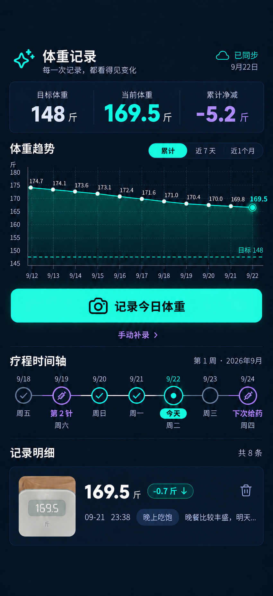
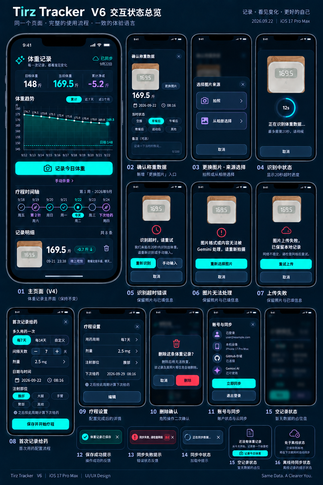

# Tirz Tracker 单页整体设计说明 V6

## 1. 设计目标

在 V4 单页首页结构上补齐现有功能的查看、新增、修改、删除、同步、认证与异常反馈体验。所有操作仍发生在同一页面，不新增底部导航、页面 Tab 或独立业务页面。

核心原则：

- 首页顺序保持为：`指标卡 → 趋势 → 记录今日体重 → 疗程时间轴 → 记录明细`。
- 首页是唯一主页面；辅助操作使用底部弹层、紧凑确认框、照片查看器、Toast 或行内状态。
- 每个弹层只有一个高强调主操作，删除专用红色，疗程功能使用淡紫色语义。
- 保留原有深海军蓝玻璃 HUD、薄荷绿主色和双行记录卡，不引入第二套视觉语言。
- 优先复用现有接口和 DOM ID；明确标注尚未接通的能力，不把设计稿当作已实现功能。

## 2. 现有功能盘点

| 功能域 | 当前能力 | 当前缺口 | V5 设计处理 |
| --- | --- | --- | --- |
| 关键指标 | 目标、当前、累计净减等数据计算 | 当前代码仍有旧四卡结构 | 收敛为 V4 三列共享指标容器 |
| 趋势 | Chart.js 累计数据 | 尚未实现累计/7天/1个月切换 | 增加三段范围切换，默认累计 |
| 体重新增 | 相册、拍照、Gemini 识别、手动补录、确认入库 | 入口和识别反馈较分散，确认阶段不能换图 | 统一为主按钮 + 来源选择 + 可换图的称重确认弹层 |
| 体重查询 | 记录列表、差值、状态、备注、照片 | 长备注可撑出第三行 | 固定照片跨两行，右侧严格两行 |
| 体重修改 | 后端 PATCH 已支持体重、日期、时间、状态、备注、照片 | 前端只暴露照片替换 | 新增“编辑体重记录”底部弹层并接通完整 PATCH |
| 体重删除 | 本地删除、云端删除、二次确认 | 删除后云端失败仅 Toast | 保留二次确认，补充“本地已删/云端待重试”状态 |
| 照片凭证 | JS 已有打开与替换逻辑 | 页面缺少 `photoViewerModal` 结构 | 补齐照片查看器，支持更换照片和关闭 |
| 疗程查询 | 首页可计算当前针次和下次给药时间 | 只能看摘要，无法查看历史详情 | 时间轴节点点击打开“给药详情”弹层 |
| 疗程新增 | 后端 POST `/api/doses` 已存在 | 前端没有新增入口、首次周期配置和表单 | “下次给药/今天”节点提供“记录给药”弹层；首次记录先配置周期 |
| 疗程修改 | 暂无 | 后端没有 PATCH `/api/doses/:id` | V6 设计保留编辑入口，实现阶段补充接口 |
| 疗程删除 | 后端 DELETE 已存在 | 前端没有删除入口 | 给药详情中提供危险操作与二次确认 |
| 账号认证 | 登录、首次设备绑定、180 天信任 | 弹层视觉层级不统一 | 统一成“登录验证”和“首次设备绑定”安全弹层 |
| 账号与同步 | 会话状态、刷新、退出、GitHub/Gemini 状态 | 技术配置暴露过多，层级偏重 | 用户层只展示连接状态和操作；技术细节折叠 |
| 同步 | 自动同步、手动刷新、本地缓存 | 缺少稳定的待同步和重试模型 | 增加同步中、已同步、待同步、失败可重试四态 |
| PWA | 添加到主屏幕提示、缓存更新 | 提示可能遮挡页面操作 | 改为底部安全区上方轻量横幅，可永久关闭 |
| 通知反馈 | Toast、加载遮罩、行内错误 | 缺少识别超时、图片格式、上传失败的恢复路径 | 统一成功、警告、失败、加载、离线状态规范，并保留照片和表单输入 |

## 3. 单页信息架构

主页面从上到下固定为：

1. 顶栏：产品名、日期、同步状态。
2. 关键指标：目标体重、当前体重、累计净减。
3. 体重趋势：累计、近 7 天、近 1 个月。
4. 主操作：记录今日体重；次级入口为手动补录。
5. 疗程时间轴：最近给药、今天、下次给药。
6. 记录明细：秤面照片与两行信息。

所有扩展能力通过覆盖层完成：

| 交互类型 | 使用场景 |
| --- | --- |
| 底部弹层 | 称重确认、编辑记录、记录给药、给药详情、账号与同步 |
| 居中紧凑确认框 | 删除体重、删除给药、退出登录 |
| 全屏照片查看器 | 查看秤面凭证、更换照片 |
| 来源选择 Action Sheet | 拍照、从相册选择、手动输入 |
| Toast | 成功、轻量错误、后台同步结果 |
| 行内状态 | 表单校验、图片识别失败、云端待同步 |

## 4. 首页模块规范

### 4.1 顶栏

- 左侧显示 `体重记录` 和副标题。
- 右侧显示同步图标、状态文字和日期。
- 点击同步状态打开“账号与同步”；下拉刷新或点击图标执行手动同步。
- 头部不放版本号、Token 输入框或多个同级按钮。

### 4.2 关键指标

同一行固定展示：`目标体重 148斤`、`当前体重 169.5斤`、`累计净减 -5.2斤`。三项共享一个表面，用分隔线而非独立卡片区分。

### 4.3 趋势

- 首次进入固定选择 `累计`，另支持 `近7天`、`近1个月`。
- 切换只改变图表数据，不移动其他模块。
- 最新点使用薄荷绿光圈，目标体重使用低饱和虚线。
- 点击数据点显示日期、体重、称重状态；无数据时保留相同高度。

### 4.4 记录今日体重

- 全页唯一高强调主按钮。
- 点击后打开来源选择，不跳转页面。
- 识别中禁止重复提交；20 秒超时后提示“识别超时，请重试”。
- 识别成功进入称重确认弹层；手动补录直接进入同一弹层的空白状态。
- 确认弹层中的图片区域提供 `更换图片`，点击后打开来源选择：`拍照`、`从相册选择`、`取消`。
- 更换图片只替换待识别图片，不清空用户已填写的日期、时间、状态、备注；新图开始识别后沿用同一确认弹层。
- 图片异常不关闭确认弹层：保留原图和字段，错误显示在图片与体重输入之间，并提供对应恢复动作。

### 4.5 疗程时间轴

- 给药节点为紫色，今天为薄荷绿，普通日期为灰蓝。
- 已给药节点点击查看详情；今天或下一次节点点击“记录给药”。
- 时间轴本身只显示关键信息，编辑和删除在弹层内完成。
- 当没有任何给药记录时，首次点击“记录给药”进入初始化表单，先选择用药间隔 `每7天`、`每14天` 或 `自定义`。
- 自定义间隔使用数字输入和单位 `天`，保存后按该周期计算下一次给药日期；之后的记录默认沿用，可在“疗程设置”中修改。

### 4.6 记录明细

- 保留原页面照片主导的玻璃卡片。
- 左侧照片跨两行。
- 第一行：体重、单位、变化值、删除按钮。
- 第二行：日期、时间、称重状态、单行备注。
- 备注超出后省略，不增加第三行；卡片高度固定 `92–108px`。
- 点击照片打开照片凭证；点击体重和文本区域打开编辑弹层；删除按钮直接进入删除确认。

## 5. 弹层与 CRUD 设计

### 5.1 称重确认 / 新增

字段：照片、体重、日期、时间、称重状态、备注。照片区域下方增加 `更换图片`，底部按钮为 `取消` 和 `确认入库`。

状态：

- AI 成功：显示识别值与简短可信提示。
- 识别进度：显示 20 秒倒计时/进度状态，期间主操作锁定但允许取消。
- 识别超时：提示 `识别超时，请重试`，提供 `重新识别`、`手动输入`，保留当前照片和全部字段。
- 图片无法处理：提示 `图片格式或内容无法被 Gemini 处理，请重新拍摄`，提供 `重新选择图片`；不要求用户理解 JPG 等技术格式。
- 图片上传失败：提示 `图片上传失败，已保留本地记录`，提供 `重试上传`；本地数据和原图继续保留。
- AI 失败：保留照片，聚焦体重输入，提示可手动输入。
- 保存中：主按钮显示加载并锁定。
- 本地成功、云端失败：关闭弹层并显示“本地已保存，云端待同步”，不可丢失输入。

### 5.2 编辑体重记录

复用称重表单，预填原数据。增加 `更换照片`，主按钮改为 `保存修改`。保存成功后局部刷新指标、趋势、时间轴相关值和记录列表。

### 5.3 照片凭证

全屏深色查看器展示原图、体重、日期时间和称重状态。底部提供 `更换照片` 与 `关闭`；不在照片查看器中放删除记录。

### 5.4 删除确认

文案必须明确对象与后果，例如：`删除这条体重记录？删除后将从本机和云端移除，无法恢复。` 按钮为 `取消` 和红色 `删除`。

### 5.5 记录给药

首次记录使用标题 `首次记录给药`，字段：针次、剂量、日期、时间、注射部位、当前体重、备注、用药间隔。

- 用药间隔提供 `每7天`、`每14天`、`自定义` 三段选择。
- 自定义显示 `间隔天数` 数字输入，范围建议 `1–90` 天，并在输入下方显示下一次给药预览。
- 首次保存主按钮为 `保存并开始疗程`；说明文字为 `之后按此周期计算下次给药`。
- 已有疗程时标题改为 `记录给药`，间隔默认带出当前疗程设置，仍允许本次调整。
- 保存成功后时间轴更新最近给药、当前周期、下一次给药和进度；疗程详情中可查看 `每7天`。

### 5.6 给药详情

展示针次、剂量、日期时间、部位、当时体重和备注。底部提供中性 `编辑` 与危险 `删除`。删除需要二次确认。

### 5.7 账号与同步

用户层只显示：登录邮箱、设备信任状态、GitHub 存储连接、Gemini 服务状态、上次同步时间。操作为 `立即同步` 和 `退出登录`。

GitHub PAT 等技术配置不默认展示；确需兼容时放入折叠的“高级配置”，避免普通用户误操作。

## 6. 统一视觉与交互令牌

| 用途 | 规范 |
| --- | --- |
| 页面背景 | `#06111F` |
| 表面 | `rgba(11, 26, 42, 0.88)` |
| 主强调 | `#27F2C3` |
| 疗程强调 | `#A88BFF` |
| 危险操作 | `#FF496A` |
| 主文字 | `#F4F7FB` |
| 次级文字 | `#93A4B8` |
| 分隔线 | `rgba(145, 166, 190, 0.18)` |
| 底部弹层圆角 | 顶部 `20px` |
| 紧凑确认框圆角 | `16px` |
| 触控目标 | 最小 `44 × 44px` |
| 页面水平边距 | `16px` |

发光只用于主按钮、当前趋势点和“今天”节点。删除按钮不发光；错误依靠红色、图标和文字共同表达。

## 7. 系统状态文案

| 状态 | 用户文案 | 行为 |
| --- | --- | --- |
| 已同步 | `已同步` | 无需操作 |
| 同步中 | `正在同步数据…` | 禁止重复触发 |
| 待同步 | `已保存到本机，联网后自动同步` | 后台重试 |
| 同步失败 | `同步失败，请检查网络` | 提供 `重试` |
| 识别中 | `正在识别秤面数字…` | 最长 20 秒 |
| 识别超时 | `识别超时，请重试` | 保留照片，可重试或手动输入 |
| 图片无法处理 | `图片格式或内容无法被 Gemini 处理，请重新拍摄` | 重新选择图片，不清空表单 |
| 图片上传失败 | `图片上传失败，已保留本地记录` | 重试上传，保留本地数据 |
| 图片来源选择 | `选择图片来源` | 拍照、从相册选择、取消 |
| 首次疗程 | `之后按此周期计算下次给药` | 保存周期并开始疗程 |
| 空记录 | `还没有体重记录` | 提供 `记录今日体重` |
| 删除成功 | `记录已删除` | Toast，可选短时撤销仅限本地阶段 |

## 8. 响应式与可访问性

- 以 iPhone 17 Pro Max 约 `440 × 956 CSS px` 为设计基准，兼容 `390 × 844px`。
- 弹层使用 `max-height: calc(100dvh - safe-area)`，字段过多时弹层内部滚动。
- 页面、弹层、Toast 同时尊重 `env(safe-area-inset-top)` 和 `env(safe-area-inset-bottom)`。
- 键盘弹出时保持当前字段和主按钮可见，不强制关闭弹层。
- 文字与背景满足 WCAG AA；状态不能只依赖颜色。
- 弹层必须具备 `role="dialog"`、标题关联、焦点锁定、Esc/关闭按钮和返回焦点。

## 9. 实施优先级

### P0：主链路

- V4 首页结构、趋势范围切换、双行记录卡。
- 称重新增、编辑、删除、照片查看与替换。
- 同步四态、错误重试、空数据和加载状态。
- 补齐缺失的照片查看器 DOM。
- 确认称重弹层增加更换图片、来源选择和三类图片异常恢复态。

### P1：疗程 CRUD

- 时间轴节点交互、给药新增、详情、删除。
- 增加给药修改接口和前端编辑流程。
- 首次给药增加周期配置、下一次给药预览和疗程设置回看。

### P2：账号与安装体验

- 账号与同步弹层简化、登录/设备绑定统一。
- PWA 安装横幅和高级配置折叠。

## 10. 验收标准

- 不新增业务页面、底部导航或页面级 Tab。
- 首页信息顺序和 V4 一致，记录卡保持两行。
- 新增、查看、修改、删除体重均可完成并同步反馈。
- 给药记录可新增、查看、修改、删除，所有危险操作均二次确认。
- 照片可查看和替换；缺图时显示补凭证入口。
- 确认称重中可以换图；识别超时、图片无法处理、图片上传失败均不丢失图片和表单输入，并提供可执行恢复动作。
- 首次给药可选择每 7 天、每 14 天或自定义周期，保存后正确计算下一次给药。
- 同步失败不导致本地记录丢失，用户可以明确重试。
- 所有弹层在 iPhone Safari 与 PWA 中不被 Dynamic Island、键盘或 Home Indicator 遮挡。

## 11. 非范围

- 不改变 Gemini 识别提示词和 GitHub 数据仓库结构。
- 不新增多用户、社交、医生端或用药提醒推送。
- 不把技术 Token 作为日常用户主流程。
